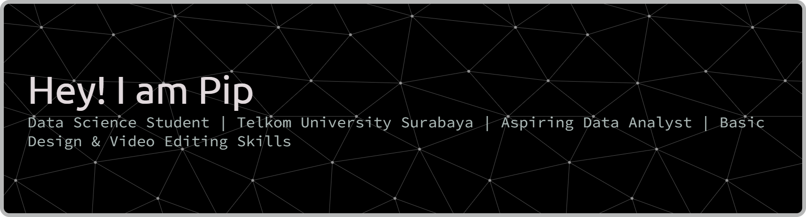

## Hi there 👋

🎓 Data Science Student | Telkom University, Faculty of Informatics

Passionate about transforming data into actionable insights through analytics, machine learning, and visualization.
Currently pursuing a Bachelor’s degree in Data Science, developing strong foundations in statistics, programming, and big data technologies.

💡 Interests: Data Analysis, Machine Learning, AI, Data Engineering, and Cloud Computing.
🧰 Tech Stack: Python, R, SQL, TensorFlow, Scikit-learn, PySpark

🚀 Always eager to learn, collaborate, and contribute to open-source projects that bring value through data-driven innovation.

#### My Skills

#### Connect with me
  

#### My Github Stats

#### Play Game wih ME

<picture>
  <source media="(prefers-color-scheme: dark)" srcset="https://raw.githubusercontent.com/rafifkri/rafifkri/output/pacman-contribution-graph-dark.svg">
  <source media="(prefers-color-scheme: light)" srcset="https://raw.githubusercontent.com/rafifkri/rafifkri/output/pacman-contribution-graph.svg">
  
</picture>

 

